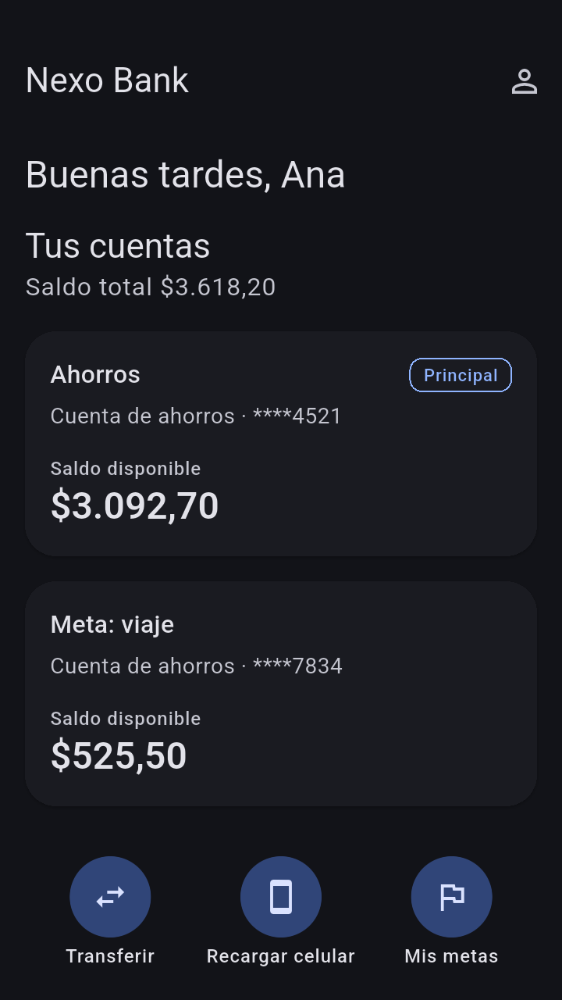
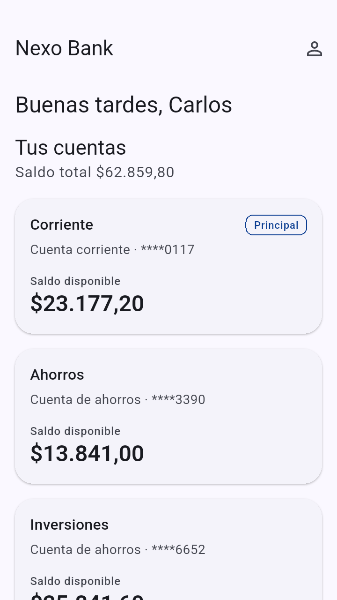
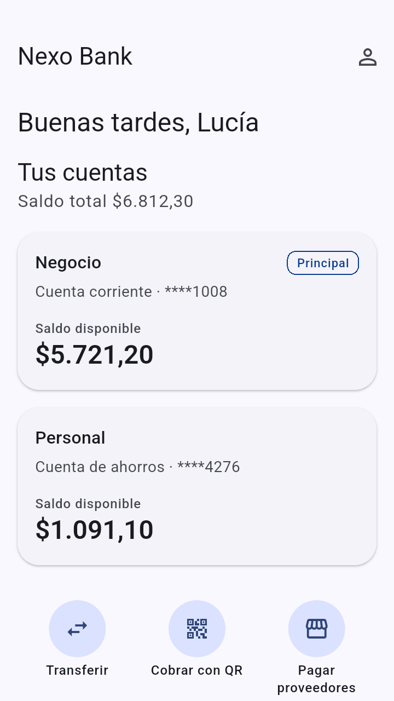
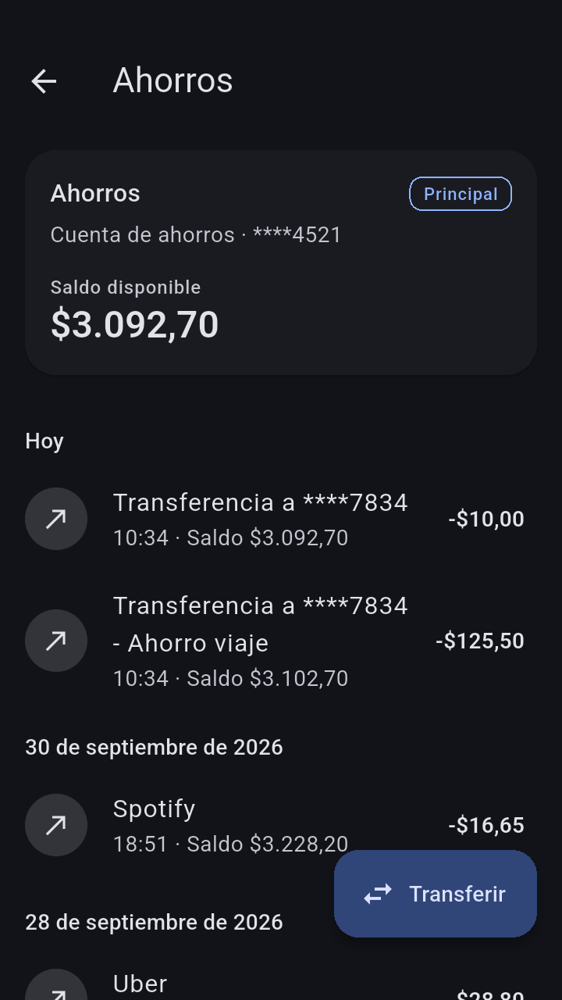
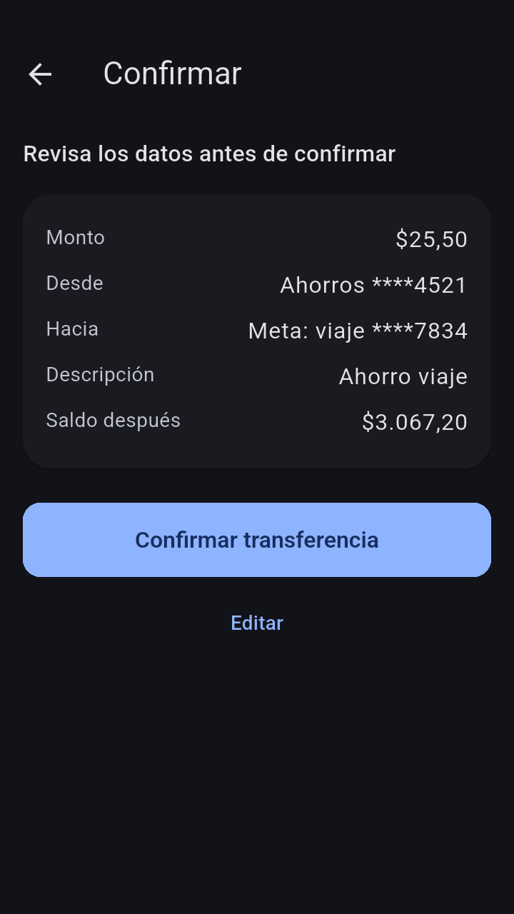

# Nexo Bank: app móvil (Flutter)

App de banca personas. Arquitectura hexagonal por feature
(`domain` · `application` · `infrastructure` · `presentation`) con Bloc.

| Home joven (Ana) | Home premium (Carlos) | Home emprendedor (Lucía) | Movimientos | Confirmar transferencia |
|---|---|---|---|---|
|  |  |  |  |  |

Capturas reales del emulador contra el backend (`docs/screenshots/`). La
misma app muestra un home distinto por segmento, y el tema oscuro de Ana
viene de sus preferencias guardadas en el backend.

**Documentación:** [ADRs](docs/adr/README.md) ·
[Uso de IA](docs/AI_USAGE.md) · [Contribuir](CONTRIBUTING.md)

## Requisitos

- Flutter 3.47.6 (stable), Dart 3.13
- Backend levantado (`app-backend`, `docker compose up`)

## Ejecutar

```bash
flutter pub get

# Emulador Android contra el gateway (valor por defecto)
flutter run --dart-define=API_BASE_URL=http://10.0.2.2:8080

# Simulador iOS
flutter run --dart-define=API_BASE_URL=http://localhost:8080

# Producción: HTTPS con certificate pinning (pin actual + pin de respaldo)
flutter build apk --release \
  --dart-define=API_BASE_URL=https://api.nexo.ec \
  --dart-define=PIN_SHA256=<pin actual>,<pin de respaldo>
```

### Backend: sin configurar nada

Con el **Run por defecto del IDE** (o `flutter run` a secas) la app elige sola
el backend según dónde corre:

| Dispositivo | Backend |
|---|---|
| Cualquier teléfono físico (WiFi o datos) | Túnel HTTPS fijo `https://ragweed-onshore-correct.ngrok-free.dev` → gateway local |
| Emulador de Android | `http://10.0.2.2:8080` (la PC, directo) |
| Simulador de iOS | `http://localhost:8080` (la PC, directo) |

Al arrancar se imprime en consola `Backend (staging|dev): <url>`.

Requisito para teléfonos físicos: el backend y el túnel levantados en la PC
(`docker compose --profile tunnel up -d` en `app-backend`).

Una URL explícita siempre manda (`config/*.json`), por ejemplo para
producción o para un APK de testers:

```bash
flutter build apk --release --dart-define-from-file=config/prod.json
```

En debug se permite HTTP sin TLS (para el backend local). Los builds de
release exigen HTTPS.

Usuarios de prueba: `ana` (joven), `carlos` (premium) y `lucia`
(emprendedora), con contraseña `Nexo2026*`. Cada uno ve un home distinto.
También puedes crear una cuenta desde "¿No tienes cuenta? Crea una".

## Calidad

```bash
flutter analyze
flutter test

# E2E en un emulador o dispositivo, contra el backend real:
#  1) login → home → movimientos
#  2) login → transferencia propia → los saldos cambian (devuelve el dinero)
flutter test integration_test/login_movements_test.dart integration_test/own_transfer_test.dart -d emulator-5554

# Regenerar las capturas de docs/screenshots
flutter drive --driver=test_driver/integration_test.dart \
  --target=integration_test/screenshots_test.dart -d emulator-5554

# Contrato contra el backend real vía gateway (opcional; mueve $1,00
# entre cuentas de `carlos` y lo devuelve)
CONTRACT_BASE_URL=http://localhost:8080 flutter test test/contract
# ...incluyendo el registro (crea un usuario nuevo en cada corrida)
CONTRACT_BASE_URL=http://localhost:8080 CONTRACT_REGISTER=1 flutter test test/contract

# Demo de resiliencia con Toxiproxy: latencia → caída → circuito abierto →
# recuperación (restaura Toxiproxy al terminar)
CHAOS_BASE_URL=http://localhost:8080 flutter test test/chaos

# Regenerar los golden tests del home SDUI
flutter test --update-goldens test/features/experience/sdui_golden_test.dart
```

## Flujo de trabajo

Ver [CONTRIBUTING.md](CONTRIBUTING.md) (Trunk Based Development y Conventional Commits).

## Estructura

```
lib/
├── app/            app · router · di · session · ajustes · bloqueo biométrico
├── core/           config · network (Dio, interceptores, pinning) · security
│                   (tokens, JWE, biometría) · storage (Hive cifrado) ·
│                   connectivity · money · navigation (deep links) · result
├── design_system/  tema · tokens · widgets (skeleton, banners, estados)
└── features/
    ├── auth/           login · onboarding (registro en 4 pasos)
    ├── accounts/       cuentas · movimientos
    ├── transfers/      formulario · confirmación · comprobante
    ├── customer/       perfil · preferencias (edición optimista)
    ├── experience/     home SDUI · registry · componentes
    ├── fx/             tipo de cambio (servicio externo)
    └── notifications/  aviso local tras transferir · deep links
test/               unit · bloc · widget · golden · contract · chaos
integration_test/   E2E (login y movimientos · transferencia) · capturas
docs/               ADRs · uso de IA · capturas
```

## Home dinámico (SDUI)

`GET /experience/home` devuelve la lista de componentes del home según el
segmento, la hora y las preferencias. La app recorre `components` en orden y
el `ComponentRegistry` traduce cada `type` a un widget:

| type | Qué muestra | Estado propio |
|---|---|---|
| `greeting` | Saludo | — |
| `accounts_summary` | Cuentas y saldo total | `AccountsBloc` |
| `quick_actions` | Accesos por deep link | — |
| `savings_goal` | Progreso de una meta | `AccountsBloc` |
| `promo_banner` | Promoción con deep link | — |
| `fx_rates` | Tipo de cambio | `FxCubit` |

- Un `type` desconocido o con props inválidas **se ignora**: el backend puede
  publicar componentes nuevos sin romper versiones viejas de la app.
- El último layout se guarda en caché y se revalida con `ETag` (304).
- Si ms-customer no responde y no hay caché, se usa
  `assets/experience/home_fallback.json`.
- Cada sección se degrada sola: si cae el tipo de cambio se oculta; si cae
  ms-accounts, las cuentas muestran su caché.

Deep links soportados: `app://transfers`, `app://accounts/{id}`,
`app://profile`, `app://home`. Los demás muestran "disponible pronto".

## Idiomas (español e inglés)

Toda la app está traducida con `gen-l10n` (`lib/l10n/app_es.arb` y
`app_en.arb`):

- **El idioma de la app es el del teléfono** (el primero soportado de su
  lista de idiomas; si ninguno lo es, español). No hay selector de idioma en
  la app: si el cliente cambia el idioma del teléfono, la app cambia en vivo.
  La app informa ese idioma al backend para que los push lleguen igual.
- Montos (`$1.250,50` / `$1,250.50`), fechas, textos para lectores de
  pantalla y la notificación local siguen el idioma activo.
- Los errores del backend se traducen por su `code`; nunca se muestra su
  `detail`, que llega en español.
- La app envía `Accept-Language` en cada petición.
- **Textos de la interfaz, siempre de la app.** Del backend solo se muestran
  los **nombres** (del cliente, de sus cuentas y metas) y los datos
  sensibles (enmascarados):
  - **Saludo:** la app lo arma con la hora local ("Buenas tardes" / "Good
    afternoon") y el nombre del perfil; ignora el texto del backend.
  - **Cuentas:** sin alias se muestra el tipo traducido. Los alias genéricos
    del banco ("Ahorros", "Corriente", "Cuenta de ahorros", "Inversiones"…)
    se traducen, validando que coincidan con el tipo de cuenta ("Ahorros"
    solo en una de ahorros). Un alias propio del cliente ("Meta: viaje") se
    respeta.
  - **Home SDUI:** títulos de secciones, accesos rápidos (por `id`), el
    encabezado "Meta de ahorro" (de la meta solo se toma su nombre) y las
    promociones conocidas (por su destino) tienen texto de la app. Una
    campaña nueva que la app no conoce muestra el texto del backend, que
    puede venir por idioma: `"title": {"es": "...", "en": "..."}`.

Para agregar un texto: añadirlo en ambos `.arb` y usar `context.l10n.clave`.

## Seguridad

| Medida | Detalle | ADR |
|---|---|---|
| Login cifrado con JWE | RSA-OAEP-256 + A256GCM con la clave `enc` del JWKS; la contraseña nunca viaja en claro | [0008](docs/adr/0008-login-con-jwe.md) |
| Certificate pinning | Por clave pública (SPKI), activo con `PIN_SHA256` en producción | [0009](docs/adr/0009-certificate-pinning-spki.md) |
| Tokens | Solo en Keychain/Keystore; refresh rotativo con cola ante 401 | — |
| Caché cifrada | Hive con AES-256; se borra al cerrar sesión | [0003](docs/adr/0003-hive-ce-cifrado.md) |
| Biometría | Opcional, por dispositivo: el login ofrece "Ingresar con huella o rostro" junto a usuario y contraseña | [0010](docs/adr/0010-biometria-y-privacidad.md) |
| Privacidad | `FLAG_SECURE` en Android release; la app se tapa en el selector de apps | [0010](docs/adr/0010-biometria-y-privacidad.md) |
| Datos enmascarados | Cuentas `****4521`, cédula y teléfono enmascarados desde el backend | — |
| Dinero | Idempotency-Key por operación, sin reintentos ni cola sin conexión | [0006](docs/adr/0006-dinero-sin-conexion.md) |

## Notificaciones

Tras una transferencia, ms-customer envía una **push con Firebase Cloud
Messaging**: llega con la app cerrada, en segundo plano o abierta, e incluso
si la transferencia se hizo desde otro dispositivo. Tocarla abre el detalle
de la transferencia. Si el cliente desactiva las notificaciones en su
perfil, no se envía. El contenido se oculta en la pantalla de bloqueo.

Firebase es **opcional** ([ADR 0011](docs/adr/0011-push-con-firebase-opcional.md)):
sin configurarlo, la app compila igual y muestra un aviso local tras cada
transferencia hecha en ella.

Para activar la push (una vez, unos 10 minutos):

1. En [Firebase Console](https://console.firebase.google.com) crear un
   proyecto y agregar una app **Android** con el paquete `ec.nexo.nexo_bank`.
2. Descargar `google-services.json` y copiarlo en `android/app/` (está en
   `.gitignore`).
3. En el proyecto: *Configuración → Cuentas de servicio → Generar nueva
   clave privada*. Guardar el JSON en
   `app-backend/secrets/firebase-adminsdk.json` y en `app-backend/.env`:
   `FCM_CREDENTIALS_FILE=/run/secrets/nexo/firebase-adminsdk.json`.
4. `docker compose up -d ms-customer` (en `app-backend`) y `flutter run`.

Para probarla: iniciar sesión (acepta el permiso), cerrar la app y hacer una
transferencia desde otro lado, por ejemplo con `curl` al gateway
(ver el README del backend). La notificación llega a la bandeja.

## Resiliencia

- **Stale-while-revalidate:** cuentas y movimientos se muestran primero
  desde la caché cifrada (Hive CE + AES, clave en Keychain/Keystore) y
  luego se actualizan. Si el backend falla, los datos guardados siguen
  visibles con el banner "No pudimos actualizar".
- **Retry:** solo GET, 3 intentos con backoff exponencial y jitter.
- **Circuit breaker:** por servicio; tras 5 fallos corta 30 s y luego
  prueba con una petición.
- **Sin conexión:** banner global y refresco automático al volver la red.
- **Transferencias:** nunca se reintentan ni se encolan. La
  `Idempotency-Key` se crea al confirmar; si no hay respuesta, "Verificar
  estado" reenvía la misma clave y el backend devuelve el resultado
  original sin duplicar el movimiento.
- Al cerrar sesión se borran tokens y caché.
